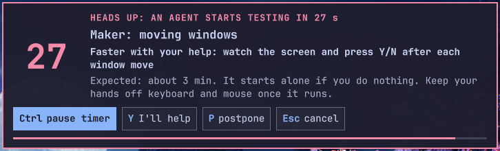
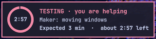
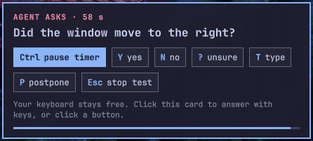
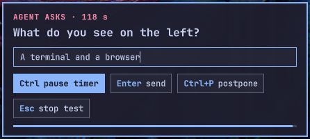
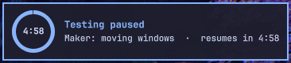

# Background Worker Talk To Me

<a href='https://ko-fi.com/akton1' target='_blank'></a>

Omarchy shell plugin that lets a script or AI agent that changes your desktop (moving windows, workspaces, the bar, animations) ask you quick yes/no questions, instead of slow screenshot loops.

## Why you want this
AI agents that build or tweak your Omarchy desktop (plugins, Hyprland config, bar, animations, games) cannot see what you see. Screenshot loops are slow and often wrong, and an agent that suddenly opens windows or sends keys while you work spoils its own test: a stray click of yours looks like a failed test. This plugin gives you and the agent a short handshake:

- **You know when it starts, and about how long it takes.** A countdown and an always-visible TESTING banner say "hands off the mouse and keyboard now". The agent gives an estimate (`--estimate 3m`): the card shows "Expected duration: about 3 min", the banner keeps showing "Expected 3 min · about 2:10 left" for the whole test and says "taking longer" when it overruns. You can postpone (P) or cancel (Esc).
- **The agent gets your eyes.** One key (Y / N / ?) or a typed reply answers "did the window move?" in seconds, instead of a screenshot round trip.
- **It cannot forget.** A guard hook makes the agent start a session before it touches your desktop (see "Which commands are guarded").

### Only when you or the test could disturb each other
A session (countdown + banner) is for work that uses **your** screen, keyboard or mouse: the test needs your display or input focus, or your clicks would spoil it, or it moves your windows. Work that cannot touch you needs none: files and code, `--headless` runs, a **nested compositor on a virtual `HEADLESS-n` monitor** (screenshots of a scratch desktop), commands aimed at another compositor (their own `HYPRLAND_INSTANCE_SIGNATURE` / `WAYLAND_DISPLAY`). The guard hook lets those pass, the agent watcher ignores windows that open on a `HEADLESS-n` monitor, and an agent can mark a command `TALK_TO_ME_ISOLATED=1 <command>` when it knows it is isolated. If a window opens on a monitor you look at, it is not isolated.

### Use cases
- Building an Omarchy plugin: the agent reloads the shell, opens your panel and asks "does the popup look right on both monitors?".
- Tuning Hyprland: workspace rules, window moves, opacity or animation values, with you as the judge ("which of these three looks best?").
- Testing a game or GUI app: the agent warns you before a window pops up, asks whether it looks right, and does not count your stray click as a bug.
- Long autonomous runs: you work in another app; the agent posts a status line on the banner, or (experimental) asks a blocking question on screen.
- Anything where a screenshot cannot show the answer (animation, timing, "feels laggy").

### Screenshots
**1. Countdown bar with the agent's offer.** The agent says what you could do faster than it can alone; Y = "I'll help", P = postpone, Esc = cancel.


**2. TESTING badge.** Always visible in the top-right corner while the agent works: a ring with the time left, the title, the estimate and the latest status line.


**3. A question you answer with one key.** Y / N / ? (or T to type, P to postpone, Esc to stop the test).


**4. A typed reply.** For open questions the agent gets your own words back on the command line.


**5. Postponed.** You asked for time; the badge turns blue ("Testing paused", ring counting down) and the agent waits.


## Works with any agent
Three layers, from "needs nothing" to "needs a hook". Omarchy can launch Claude Code, Codex, Gemini CLI, OpenCode, pi, Crush, Copilot, Cursor, Grok and more, so the plugin does not depend on one of them.

1. **Always-on watcher (any agent, no setup).** The plugin watches Hyprland's window events. When a window opens whose process (or one of its parents) is an agent, or whose environment carries an agent marker (`AI_AGENT`, `CLAUDECODE`, `OPENCODE`, `GEMINI_CLI`, `CODEX_*`, ...), and no session is active, you get an "AGENT ACTIVITY" banner on every screen for 12 s, so you know to keep your hands off. It only checks whether an agent marker variable is set and never stores or sends environment contents. It cannot stop the agent, and it only sees windows opened from an agent's own commands (an app that reuses an already running instance, or one started by `hyprctl dispatch exec`, is not attributed). Switch it off with `talk-to-me settings set watch off`; list an unusual agent in `~/.config/background-worker-talk-to-me/agent-processes` (one process name per line).
2. **Tool hook (agents that have one).** `talk-to-me-install-agent agents` installs a pre-tool hook for every agent found on the machine: Claude Code (`~/.claude/settings.json`), Codex (`~/.codex/hooks.json`), Gemini CLI (`~/.gemini/settings.json`) and OpenCode (a plugin in `~/.config/opencode/plugins/`). The hook refuses a command that touches your desktop, with instructions, until a `talk-to-me start` session is active. Tested live: Claude Code and OpenCode. Codex and Gemini CLI use the same hook protocol (JSON in, exit code 2 blocks) and are tested with simulated calls only.
3. **Instructions (every agent).** The same command adds the instruction block to each agent's global instructions file (`CLAUDE.md`, `~/.codex/AGENTS.md`, `~/.gemini/GEMINI.md`, `~/.config/opencode/AGENTS.md`, `~/.pi/agent/AGENTS.md`). Any other agent: `talk-to-me-install-agent block FILE`.

## Which commands are guarded
The hook (layer 2) reads the command the agent is about to run and refuses it, with instructions, until a `talk-to-me start` session is active. It is **not** limited to one app. Built in: `wtype`, `ydotool`, `dotool`, `omarchy-restart-shell`, `hyprctl dispatch|reload|keyword`, and window launchers (`xdg-open`, `gtk-launch`, `omarchy-launch-*`, Godot without `--headless`, `play.sh`). Reads like `hyprctl clients` and headless runs pass.

**Your own apps:** list any command that opens a window, one name per line, in `~/.config/background-worker-talk-to-me/guard-commands` (`#` starts a comment). The agent then gets the same block for it. Launcher scripts in your own projects can call `talk-to-me require` first: exit 99 for an agent run without a session, no effect when you run it by hand. Limits: a command the hook has never heard of is not blocked (the watcher still shows the banner when it opens a window), and agents without a hook (pi, Crush, Copilot, ...) rely on the watcher, the instruction block and `TALK_TO_ME_GUARD=1` with the PATH shims.

## The flow
1. **Countdown.** `talk-to-me start "Desktop testing"` shows a card "Desktop testing is about to start 5 4 3 2 1". It is a heads-up, not a question: if you are at the desk and not ready, press **P** or **Esc**; if you are away, it runs out and the agent continues alone. **Y** exists only when the agent asks for help with `talk-to-me start "title" --help "watch the screen and press Y/N after each window move"`: the card then says "Faster with your help: …" and Y = "I'll help" (human mode, `talk-to-me ask` works). **P** = postpone: type the minutes, Enter sends; the countdown waits while you type, the banner turns into a blue "Testing paused, resumes in M:SS" pill and `talk-to-me start` prints `postpone:<minutes>` (exit code 5). **Esc** = cancel (`cancelled`, exit 4: not now, the agent stops). No key = the agent goes on alone (solo mode; `talk-to-me ask` then prints `timeout` at once, so an agent that wants answers must pass `--help`).
**Easy to read.** The start countdown is a bar at the top of every screen, so your windows stay visible: a big number, a "HEADS UP" line, the title, "It starts alone if you do nothing", a progress line, and key chips with a filled **Ctrl** chip ("pause timer"; it turns into "resume (auto N s)" and the heading says "PAUSED" while frozen; the chips can be clicked too). Questions are a compact card in the bottom-right corner, and the running test is a badge with a time ring in the top-right corner. The countdown defaults to 10 s (`talk-to-me settings set countdown N`).

**Every screen, more time to read.** The countdown and question cards show on every monitor (the buttons are clickable on any of them). Tap **Ctrl alone** to freeze the countdown or question timer while you read; tap Ctrl again to continue (it resumes by itself after 120 s). Ctrl+P and other Ctrl combinations do not count. `talk-to-me` waits long enough for a hold.

2. **TESTING banner.** For the whole session a small always-on-top banner shows "TESTING in progress", the title, the mode, the expected duration and the time left. It never takes the keyboard. Click it to end the session.
3. **Questions.** `talk-to-me ask "Did the window move from left to right?"` shows the question. Press **Y** / **N**, or **?** for "can't tell", or **T** to type a reply in a textbox (Enter sends, Esc goes back), or **P** to postpone the test: type the minutes, the banner turns into a "Testing paused, resumes in M:SS" pill and the agent gets `postpone:<minutes>` (exit code 5), stops, and restarts the test after that time. In a `--text` box postponing is **Ctrl+P**. For an open question use `talk-to-me ask "What do you see?" --text`: the textbox opens at once. The command prints `yes`, `no`, `unsure`, `text:<what you typed>` or `timeout` and exits.
4. **Experimental: a question without a test.** `talk-to-me question "Which one, A or B?"` shows a plain question card (Y / N / ? / T, Esc dismisses) with no TESTING banner and no countdown, so an agent that is stuck on a decision can ask you while you work in another app. It is **off** until you run `talk-to-me settings set questions on`. Agents are told to use it only when blocked and a wrong guess is costly; `question-gap` (default 60 s) refuses a second question too soon. Esc prints `dismissed`; P (postpone) does not exist here.
5. **Stop.** `talk-to-me end` removes the banner. Safety nets: Esc on a question ends the session (Esc in the textbox opened with T only goes back; with `--text` it ends the session) (`ask` prints `ended`), the session has a hard time limit (default 20 min), a killed `talk-to-me ask` withdraws its question.

**Mouse shield (solo tests).** When nobody pressed Y, the agent works alone, so stray clicks would spoil the test. An invisible, fully transparent layer then covers every screen and swallows mouse clicks and scrolling (screenshots stay clean; the banner says "solo · mouse blocked"). The banner area stays clickable, so one click on it ends the test. When you are helping (Y), the shield is off and you can click and use hotkeys anywhere. The keyboard is not blocked, because the agent's own key presses (`wtype`) go to the focused window. Turn it off with `talk-to-me settings set shield off`; an agent that drives the mouse itself (`ydotool`) passes `--no-shield`.

The keyboard is grabbed only during the short start countdown (it needs it to hear P, Esc, Ctrl and Y when help was asked for). Question cards never take your keyboard or your focus: you keep clicking and typing in your own windows, and answer when you are ready by clicking a button, or by clicking the card once and then pressing Y / N / ? / T / P / Esc (click the textbox to type a reply).

## Commands
```
talk-to-me start [TITLE] [--help TEXT] [--estimate DUR] [--countdown SEC] [--max MIN]   -> human | solo | cancelled | postpone:<min>   (default 10 s, 20 min)
talk-to-me ask "QUESTION" [--text] [--timeout SEC]       -> yes | no | unsure | text:<typed> | postpone:<min> | timeout | ended  (default 60 s, 120 s with --text)
talk-to-me question "QUESTION" [--text] [--timeout SEC]   EXPERIMENTAL, off by default -> yes | no | unsure | text:<typed> | dismissed | timeout | busy | disabled | toosoon  (default 120 s)
talk-to-me settings [get KEY | set KEY VALUE | reset [KEY]]   list or change settings
talk-to-me say "TEXT"                                     status line on the banner for 8 s, no answer
talk-to-me eta DUR                                        revise the expected remaining time (90s, 3m, or minutes)
talk-to-me end                                            end the session
talk-to-me status                                         JSON: phase, mode, title, question, seconds left, estimateSec, elapsedSec
```
Exit codes: 0 ok, 1 error (shell not running, plugin not loaded), 3 no session, 4 you pressed Esc (`cancelled` / `ended` / `dismissed`), 5 you pressed P (`postpone:<min>`), 6 `talk-to-me question` not allowed (`disabled`, `toosoon` or `busy`).
In solo mode `talk-to-me ask` prints `timeout` at once (nobody is there to answer). Only one question at a time; a new one replaces the old.

## Settings (command line)
Stored in `~/.config/background-worker-talk-to-me/settings.conf` (plain `key=value`). `talk-to-me settings` lists them, `talk-to-me settings set KEY VALUE` changes one, `talk-to-me settings reset [KEY]` goes back to the defaults. Options on the command line (`--countdown`, `--max`, `--timeout`) always win.

| Key | Values | Default | What |
|---|---|---|---|
| `questions` | `on` / `off` | `off` | allow `talk-to-me question` (experimental) |
| `watch` | `on` / `off` | `on` | agent watcher: banner when any agent opens a window with no session |
| `shield` | `on` / `off` | `on` | invisible mouse shield over every screen during solo tests |
| `notice-seconds` | 3-120 s | 12 | how long that banner stays |
| `question-timeout` | 3-600 s | 120 | how long a question card stays |
| `question-gap` | 0-3600 s | 60 | minimum time between two questions |
| `countdown` | 1-30 s | 5 | start countdown |
| `max` | 1-240 min | 20 | session time limit |
| `ask-timeout` | 3-600 s | 60 | `talk-to-me ask` |
| `text-timeout` | 3-600 s | 120 | `talk-to-me ask --text` |

## Install
```
omarchy plugin add https://github.com/AktOn1/omarchy-background-worker-talk-to-me.git --enable        # or copy this folder to ~/.config/omarchy/plugins/io.github.akton1.background-worker-talk-to-me/
ln -s ~/.config/omarchy/plugins/io.github.akton1.background-worker-talk-to-me/bin/talk-to-me ~/.local/bin/talk-to-me
```
Requires `omarchy-shell` running. No network, no sudo, no changes to your config. State: short-lived result files in `$XDG_RUNTIME_DIR/talk-to-me/` (removed by `talk-to-me`, gone at logout).

## Try it with an agent
Open an agent (`omarchy agent`, Claude Code, ...) with the instructions installed (see "For agents") and paste one of these. Each one exercises a different feature.

### One block for everything
No mention of the plugin or `talk-to-me`. The task itself makes the agent touch the desktop (guard, countdown, banner), need a human eye (yes/no/unsure), ask for an opinion (typed reply) and choose between options (standalone question, if enabled):

```
Do a small desktop demo for me. Move this terminal to workspace 3, make it float, then put it back. Then try three window opacity values (0.8, 0.9, 1.0) on this terminal and tell me which looks best. Don't judge from screenshots: my eyes are faster, so after each change ask me what I see, and ask me in my own words what I think of each opacity. If I offer to help, use it step by step instead of doing everything first and asking at the end. If you are torn between two layouts for the result, ask me which I want instead of guessing.
```

While it runs: at the first countdown the card shows "Faster with your help: ..." (the agent's offer). Press **Y** to help (questions follow after each change), **P** to postpone, **Esc** to cancel, or do nothing and it runs alone (questions then return `timeout`). Later: **Ctrl** (freeze the timer), **T** (type a reply), **Esc** (stop). For the last step to use a popup, run `talk-to-me settings set questions on` first.

### One feature at a time
| Feature | Paste this |
|---|---|
| Whole flow | `Test the Background Worker Talk To Me plugin: talk-to-me start "plugin demo" --help "watch and answer my questions", then move this terminal to workspace 3 and ask me with talk-to-me ask whether I saw it, then ask me an open question with --text what I see, then talk-to-me end.` |
| Hands-off guard (no mention of talk-to-me) | `Move this terminal to workspace 3, make it float, then put it back.` Expect: a block message, then the countdown and the TESTING banner. |
| Open question | `Run talk-to-me start "demo", then talk-to-me ask "What do you see on screen?" --text, repeat my answer back to me, then talk-to-me end.` |
| Postpone | `Run talk-to-me start "demo". If I postpone, wait that long and start again. Then ask me one yes/no question with talk-to-me ask and talk-to-me end.` Press **P** and a number of minutes. |
| Ask for help | `Run talk-to-me start "demo" --help "tell me whether the terminal moved", move this terminal to workspace 3 and back, ask me after each move, then talk-to-me end.` Press **Y** on the countdown: the card shows the help request and the questions follow. |
| Cancel | `Run talk-to-me start "demo" and tell me what it printed.` Press **Esc**; the agent should say `cancelled` and touch nothing. |
| Question without a test (experimental) | First `talk-to-me settings set questions on` and restart the shell once. Then: `Use talk-to-me question to ask me whether to continue, A or B, and do what I answer. Do not run talk-to-me start.` |

Tips while testing: tap **Ctrl alone** to freeze a timer, **T** types a reply, **Esc** stops. `talk-to-me status` shows the current state.

## Remove
```
omarchy plugin disable io.github.akton1.background-worker-talk-to-me && omarchy plugin remove io.github.akton1.background-worker-talk-to-me
rm -f ~/.local/bin/talk-to-me; rm -rf "$XDG_RUNTIME_DIR/talk-to-me"
```

## For agents
Opt-in only. One command sets up every agent it finds: `bin/talk-to-me-install-agent agents` (tool hooks for Claude Code, Codex, Gemini CLI and OpenCode, instruction blocks for those and pi, the Claude Code skill); undo with `agents-remove`; `status` shows what is on. Hooks apply to new agent sessions. For one agent only: `all ~/.claude/CLAUDE.md` (Claude skill + block + guard) or the parts `skill`, `block FILE`, `guard`. Manual route: [docs/agent-instructions.md](docs/agent-instructions.md) is a block to paste into AGENTS.md / CLAUDE.md, and [docs/skill/background-worker-talk-to-me/SKILL.md](docs/skill/background-worker-talk-to-me/SKILL.md) is a Claude Code skill (copy to `~/.claude/skills/background-worker-talk-to-me/`). No root AGENTS.md/CLAUDE.md on purpose (the marketplace rejects them).

## Develop and test
- Logic: `node tests/model.test.js`.
- Scratch shell (does not touch your running shell): make a folder with symlinks to `/usr/share/omarchy/shell/Commons`, `Service.qml`, `TalkToMeModel.js` and a `shell.qml` containing `ShellRoot { Service {} }`; run `quickshell -n -p <folder>`; talk to it with `TALK_TO_ME_QS_PATH=<folder> bin/talk-to-me ...`.
- `omarchy plugin validate .`

## Guard for agents

Details of layer 2 (hooks), set up by `talk-to-me-install-agent agents` (Claude Code only: `guard`):

1. **Tool hook (main layer).** `bin/talk-to-me-guard-hook` is added to the agent's hook list (for Claude Code `~/.claude/settings.json`, a `PreToolUse` hook on `Bash|AskUserQuestion`; the other agents get the equivalent for their shell tool). While a session is open it also blocks the AskUserQuestion tool, so the agent has to ask on screen with `talk-to-me ask` instead of in the terminal. For Bash it looks at the command text and blocks (the agent sees the message) `wtype`, `ydotool`, `dotool`, `omarchy-restart-shell` and `hyprctl dispatch|reload|keyword`, plus anything that opens a window (Godot binaries without `--headless`, `play.sh`, `xdg-open`, `gtk-launch`, `omarchy-launch-*`) unless an `talk-to-me start` session is active. It does not depend on `PATH` order, so absolute paths are caught too. A backup is kept as `settings.json.talk-to-me-backup`; `guard-remove` takes the hook out again.
2. **PATH shims.** `bin/talk-to-me-guard` is symlinked as `wtype`, `omarchy-restart-shell` and `hyprctl` in `~/.local/bin`; inside an agent run (`AI_AGENT`, `CLAUDECODE`, `OPENCODE`, `GEMINI_CLI`, `CODEX_THREAD_ID`, `PAPERCLIP_RUN_ID`, or `TALK_TO_ME_GUARD=1` for any other agent) they exit 99 until a session is active. **Caveat:** Omarchy appends `~/.local/bin` *after* `/usr/bin` in the desktop session `PATH`, so these shims only fire where `~/.local/bin` comes first. In a normal `omarchy agent` terminal layer 1 does the work.
3. **`talk-to-me require` in your own launcher scripts.** A script that opens a window (a game's `play.sh`, an app launcher) can call `talk-to-me require "name"` at the top: exit 0 for a person, exit 99 with instructions for an agent run (same markers as above) that has no active session. It works wherever the script runs, hook or no hook. Skip it for `--headless` runs.

`TALK_TO_ME_GUARD_OFF=1` bypasses the hooks and shims (not the watcher banner).

Proposal for Omarchy itself (plugins shipping agent skills): [docs/omarchy-feature-request-agent-skills.md](docs/omarchy-feature-request-agent-skills.md).
